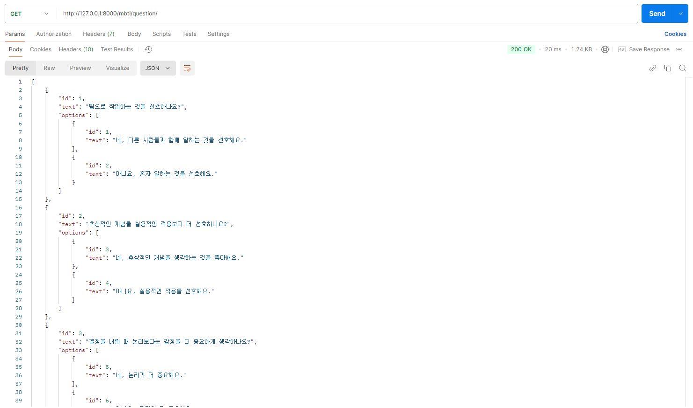
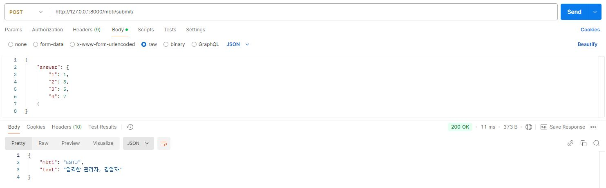
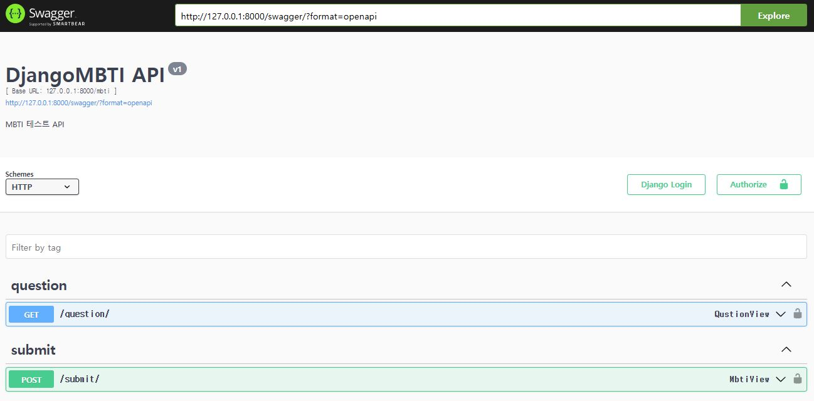
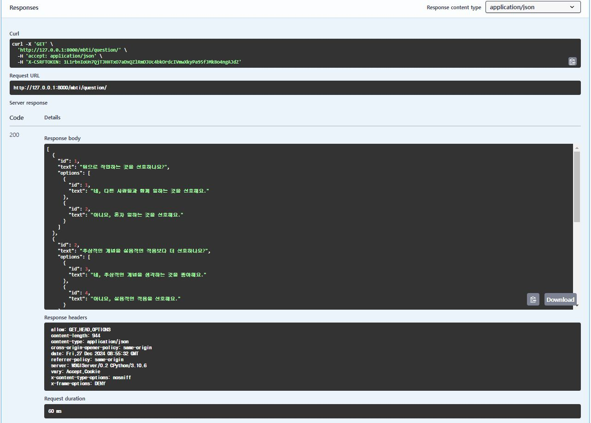
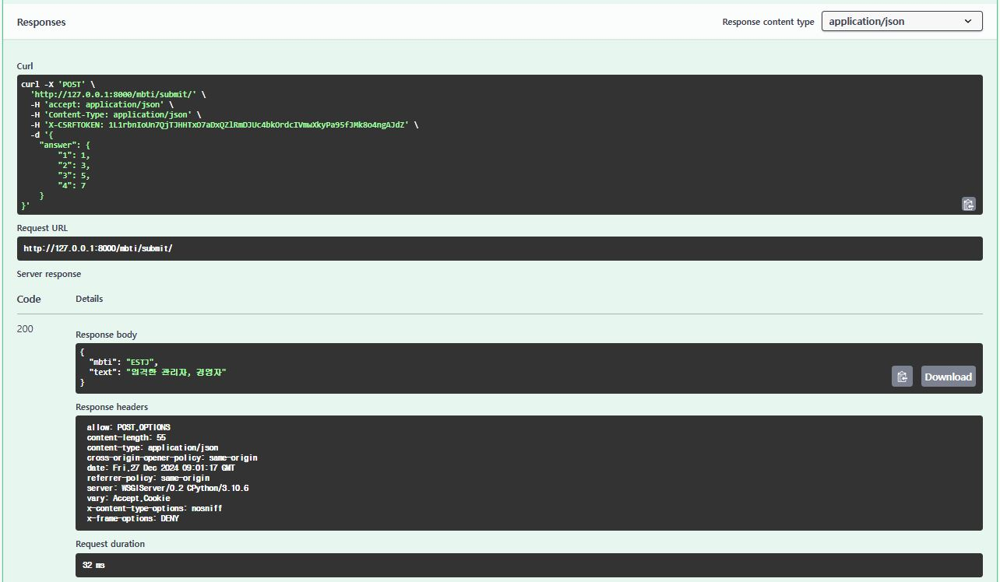
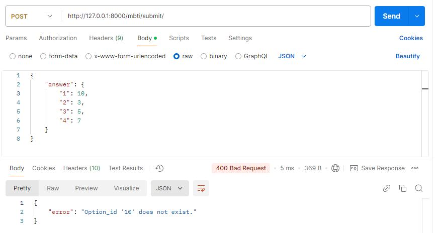

# TrialChamber
- 주제(서비스명): MBTI 테스트 API(DjangoMBTI)
    - MBTI 성격 유형 검사를 위한 API를 제공하는 프로젝트

# 개발 기간
- 24.12.09 ~ 24.12.24

# 기능
- 질문 불러오기
    - 등록된 MBTI 테스트 질문과 선택지를 반환합니다.
- 응답 제출
    - 사용자가 테스트 질문에 대한 응답 데이터를 서버로 제출합니다.
    - 제출된 데이터를 바탕으로 사용자의 MBTI 유형 결과를 반환합니다.

# DataBase Structure

# Index
[1. 기술스택 & 개발환경](#1-기술-스택--개발-환경)  
[2. 프로젝트 요약](#2-프로젝트-요약)  
[3. 주요 기능 소개](#3-주요-기능-소개)  
[4. 라이브 데모](#4-기능별-라이브-데모)  

# 1. 기술 스택 & 개발 환경
<table>
  <thead>
    <tr>
      <th>백엔드</th>
    </tr>
  </thead>
  <tbody>
    <tr>
      <td>
        
        
        
      </td>
    </tr>
  </tbody>
</table>

# 2. 프로젝트 요약
- 서비스 전체 개요
  - DjangoMBTI는 사용자에게 MBTI 테스트를 제공하는 API입니다.
  - 질문과 선택지를 API로 제공하고, 사용자 응답 데이터를 분석하여 MBTI 유형 결과를 반환합니다.
  - API의 설계 및 구현에 있어 Django REST Framework를 사용하였으며, Swagger로 API 문서를 제공합니다.

- 서비스 개발 관점
  - DRF를 활용하여 간결하고 직관적인 API 설계를 목표로 하였습니다.
  - 프로젝트는 유지 보수 및 확장성을 고려하여 객체지향적으로 설계되었습니다.
  - Swagger를 통해 API 사용 문서를 자동 생성하였으며, 사용자에게 테스트 가능한 인터페이스를 제공합니다.
  
# 3. 주요 기능 소개
## 질문 불러오기
- 사용자가 MBTI 테스트를 시작하기 전에, API 호출을 통해 질문 목록과 선택지 데이터를 가져옵니다.
- REST API를 사용하여 JSON 형식으로 데이터를 반환합니다.

## 응답 제출
- 사용자가 질문에 대한 답변을 선택한 후, API를 통해 데이터를 서버로 제출합니다.
- 제출 데이터는 {question_id: 선택지_id} 형식의 JSON 객체로 전송됩니다.
서버는 제출 데이터를 처리한 후, 결과 데이터를 반환합니다.

## Swagger API 문서 제공
- Swagger를 사용하여 프로젝트에 포함된 모든 API의 사용법을 확인할 수 있습니다.
- 각 API의 요청 방식(GET, POST 등), 요청 파라미터, 응답 형식 등을 상세히 확인 가능합니다.

 
<figure style="text-align: auto;">
  <figcaption style="margin-top: 8px; font-size: 14px; color: #555;">스웨거 메인페이지</figcaption>
  
</figure>

<figure style="text-align: auto;">
  <figcaption style="margin-top: 8px; font-size: 14px; color: #555;">스웨거 질문 불러오기</figcaption>
  
</figure>

<figure style="text-align: auto;">
  <figcaption style="margin-top: 8px; font-size: 14px; color: #555;">스웨거 응답 제출</figcaption>
  
</figure>
 

## 에러 처리 및 유효성 검사
- 잘못된 데이터 형식이나 없는 질문 ID로 요청을 보냈을 경우, 서버에서 적절한 에러 메시지와 상태 코드를 반환합니다.
- 입력 데이터 유효성을 검사하여 서버 안정성을 강화했습니다.

# 4. 기능별 라이브 데모
## 질문 불러오기

## 응답 제출
